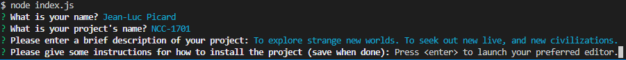

[](https://opensource.org/licenses/MIT)

# Table of Contents

[Description](#Description)

[Installation](#Installation)

[Usage](#Usage)

[Contributing](#Contributing)

[Tests](#Tests)

# Description
```
A command-line tool to build a decent project readme
```
- Providing support for future projects
- To be able to generate readmes without having to manually write the markup
- Having to manually write markup for simple text readmes
- Different types for inquirer, mapping the same property from each object in an object array to a new array
# Installation
```
If you don't already have node.js, install node.js
Navigate to the project directory via a command line interface such as bash, powershell, or zshell
```

```
Use the command 'npm install' to install dependencies from the package.json with version control from package-lock.json
```

# Usage
```
Use a command line interface to navigate to the project folder
Use the command 'node index.js' to launch the readme generator
```

```
Answer the prompts given as best as possible
```

```
If a prompt opens a text editor, such as notepad, this indicates a lengthier answer may be required
For these lengthier answers, be sure to break up parts on to new lines
When done with a text editor prompt, be sure to save the work in the text editor before exiting it
If you fail to save before exiting the text editor, your work will be lost
```

```
Once all prompts have been answered,
```

```
a new folder along with the readme and license file will be created with the input you've given.
```


# Contributing
If you would like to contribute to the project, it can be found here: [readmelicensegen](github.com/tperschon/readmegenerator)
# Tests
```
Add more questions to the const array 'questions' using the format
The type property changes how each prompt is presented
The message property controls what is displayed to the user for each prompt
The name property is how the user's answer is referenced by the code
To actually make use of the user's answer, you need to work within scope of the .then block coming after the inquirer.prompt
For example, to use the input to add more to the markup, you need to change the template literal under utils/generateMarkup.js
This works because said file is imported into index.js and then is referenced within the .then block
```
# Questions
If you have any questions, I can be reached via: [Github](github.com/tperschon) and [E-Mail](timperschon@gmail.com)